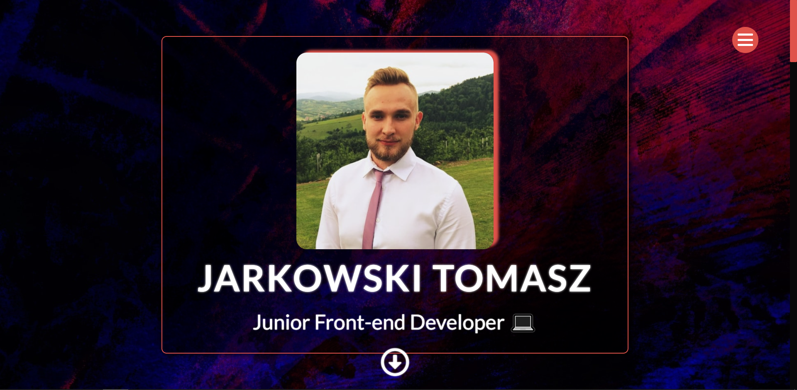

# My-Portfolio

This is my portfolio page, on it you can find a short description of my person, my skills, projects and information on how to contact me. The website was built using HTML / SCSS as well as pure JS.



## Getting Started

See the program operation in the link below or download the project, download it to your computer. Then follow the instructions.

### Installing

To initiate the project, enter in the terminal:

```
npm install
```

To start a live server, enter in the terminal:

```
npm start
```

To create a distribution version, type in terminal:

```
npm run build
```

## Built With

- HTML
- SCSS
- JavaScript
- Parcel
- RWD
- GIT

## Author

- **Jarkowski Tomasz**

## License

For personal use only. Do not distribute.
